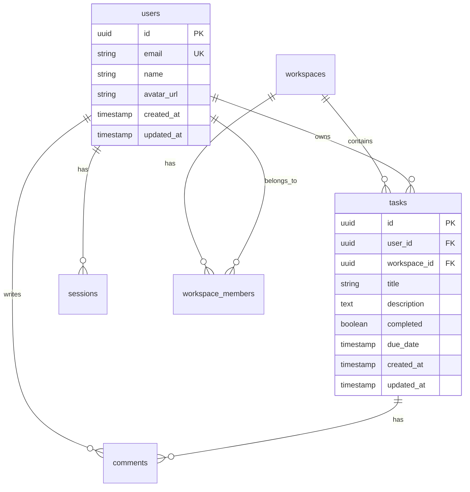

# Data Architecture

## Entity Relationship Diagram



## Schema Definitions

### Core Tables

```sql
-- Users table (managed by Better-Auth)
CREATE TABLE users (
    id UUID PRIMARY KEY DEFAULT gen_random_uuid(),
    email VARCHAR(255) UNIQUE NOT NULL,
    name VARCHAR(255),
    avatar_url TEXT,
    created_at TIMESTAMPTZ DEFAULT NOW(),
    updated_at TIMESTAMPTZ DEFAULT NOW()
);

-- Tasks table (Feature F01)
CREATE TABLE tasks (
    id UUID PRIMARY KEY DEFAULT gen_random_uuid(),
    user_id UUID NOT NULL REFERENCES users(id) ON DELETE CASCADE,
    workspace_id UUID REFERENCES workspaces(id) ON DELETE CASCADE,
    title VARCHAR(255) NOT NULL,
    description TEXT,
    completed BOOLEAN DEFAULT FALSE,
    position INTEGER NOT NULL DEFAULT 0,
    due_date TIMESTAMPTZ,
    created_at TIMESTAMPTZ DEFAULT NOW(),
    updated_at TIMESTAMPTZ DEFAULT NOW(),
    
    -- Indexes for performance
    INDEX idx_tasks_user_id (user_id),
    INDEX idx_tasks_workspace_id (workspace_id),
    INDEX idx_tasks_completed (completed),
    INDEX idx_tasks_position (position)
);

-- Workspaces table (Feature F04)
CREATE TABLE workspaces (
    id UUID PRIMARY KEY DEFAULT gen_random_uuid(),
    name VARCHAR(255) NOT NULL,
    slug VARCHAR(255) UNIQUE NOT NULL,
    description TEXT,
    created_by UUID NOT NULL REFERENCES users(id),
    created_at TIMESTAMPTZ DEFAULT NOW(),
    updated_at TIMESTAMPTZ DEFAULT NOW(),
    
    INDEX idx_workspaces_slug (slug)
);
```

### Junction Tables

```sql
-- Workspace members (Feature F04)
CREATE TABLE workspace_members (
    workspace_id UUID REFERENCES workspaces(id) ON DELETE CASCADE,
    user_id UUID REFERENCES users(id) ON DELETE CASCADE,
    role VARCHAR(50) NOT NULL DEFAULT 'member',
    joined_at TIMESTAMPTZ DEFAULT NOW(),
    
    PRIMARY KEY (workspace_id, user_id),
    INDEX idx_workspace_members_user (user_id)
);
```

### Audit Tables

```sql
-- Activity log (Feature F06)
CREATE TABLE activity_log (
    id UUID PRIMARY KEY DEFAULT gen_random_uuid(),
    user_id UUID REFERENCES users(id),
    workspace_id UUID REFERENCES workspaces(id),
    entity_type VARCHAR(50) NOT NULL,
    entity_id UUID NOT NULL,
    action VARCHAR(50) NOT NULL,
    changes JSONB,
    created_at TIMESTAMPTZ DEFAULT NOW(),
    
    INDEX idx_activity_workspace (workspace_id, created_at DESC),
    INDEX idx_activity_entity (entity_type, entity_id)
);
```

## Row Level Security (RLS)

### Users Policies
```sql
-- Users can read their own profile
CREATE POLICY users_read_own ON users
    FOR SELECT USING (auth.uid() = id);

-- Users can update their own profile
CREATE POLICY users_update_own ON users
    FOR UPDATE USING (auth.uid() = id);
```

### Tasks Policies
```sql
-- Users can read their own tasks
CREATE POLICY tasks_read_own ON tasks
    FOR SELECT USING (auth.uid() = user_id);

-- Users can read tasks in their workspaces
CREATE POLICY tasks_read_workspace ON tasks
    FOR SELECT USING (
        workspace_id IN (
            SELECT workspace_id FROM workspace_members 
            WHERE user_id = auth.uid()
        )
    );

-- Users can create tasks
CREATE POLICY tasks_create ON tasks
    FOR INSERT WITH CHECK (auth.uid() = user_id);

-- Users can update/delete their own tasks
CREATE POLICY tasks_modify_own ON tasks
    FOR ALL USING (auth.uid() = user_id);
```

## Access Patterns

### Common Queries

```sql
-- Get user's tasks (Feature F01)
SELECT * FROM tasks 
WHERE user_id = $1 
ORDER BY position, created_at DESC;

-- Get workspace tasks (Feature F04)
SELECT t.*, u.name as user_name, u.avatar_url 
FROM tasks t
JOIN users u ON t.user_id = u.id
WHERE t.workspace_id = $1
ORDER BY t.position;

-- Get activity feed (Feature F06)
SELECT a.*, u.name as user_name
FROM activity_log a
JOIN users u ON a.user_id = u.id
WHERE a.workspace_id = $1
ORDER BY a.created_at DESC
LIMIT 50;
```

### Performance Considerations
1. All foreign keys are indexed
2. Composite indexes for common filters
3. JSONB for flexible metadata
4. Positions for drag-and-drop ordering

## Data Migrations

### Migration Strategy
1. All migrations are reversible
2. Run in transactions when possible
3. Zero-downtime deployments
4. Test rollback procedures

### Example Migration
```sql
-- Migration: Add tags to tasks
BEGIN;

-- Add column (nullable first)
ALTER TABLE tasks ADD COLUMN tags TEXT[] DEFAULT '{}';

-- Backfill data if needed
UPDATE tasks SET tags = '{}' WHERE tags IS NULL;

-- Add constraint
ALTER TABLE tasks ALTER COLUMN tags SET NOT NULL;

-- Add index
CREATE INDEX idx_tasks_tags ON tasks USING GIN(tags);

COMMIT;
```

## Real-time Subscriptions

### Subscription Patterns
```typescript
// Subscribe to user's tasks
const subscription = supabase
  .channel('user-tasks')
  .on('postgres_changes', {
    event: '*',
    schema: 'public',
    table: 'tasks',
    filter: `user_id=eq.${userId}`
  }, handleTaskChange)
  .subscribe();

// Subscribe to workspace activity
const activitySub = supabase
  .channel('workspace-activity')
  .on('postgres_changes', {
    event: 'INSERT',
    schema: 'public', 
    table: 'activity_log',
    filter: `workspace_id=eq.${workspaceId}`
  }, handleNewActivity)
  .subscribe();
```

## Data Validation

### Zod Schemas
```typescript
// Task validation (shared between client/server)
export const TaskSchema = z.object({
  title: z.string().min(1).max(255),
  description: z.string().optional(),
  completed: z.boolean().default(false),
  dueDate: z.date().optional(),
  workspaceId: z.string().uuid().optional(),
});

// Workspace validation
export const WorkspaceSchema = z.object({
  name: z.string().min(1).max(255),
  slug: z.string().regex(/^[a-z0-9-]+$/),
  description: z.string().max(1000).optional(),
});
```

## Backup & Recovery

### Backup Schedule
- **Point-in-time Recovery**: Last 7 days
- **Daily Backups**: Retained 30 days
- **Weekly Backups**: Retained 90 days
- **Monthly Backups**: Retained 1 year

### Recovery Procedures
1. Identify corruption/loss
2. Stop writes if necessary
3. Restore from appropriate backup
4. Replay activity log if needed
5. Verify data integrity

## Future Considerations

### Planned Schema Changes
1. **Search**: Add full-text search indexes
2. **Attachments**: File storage integration
3. **Versions**: Task history tracking
4. **Archive**: Soft delete implementation

### Scaling Preparations
- Partition large tables by date/workspace
- Read replicas for analytics
- Materialized views for dashboards
- Consider sharding strategy at 1M+ users

---

*This document defines our data model. For feature specifications, see the PRD.*