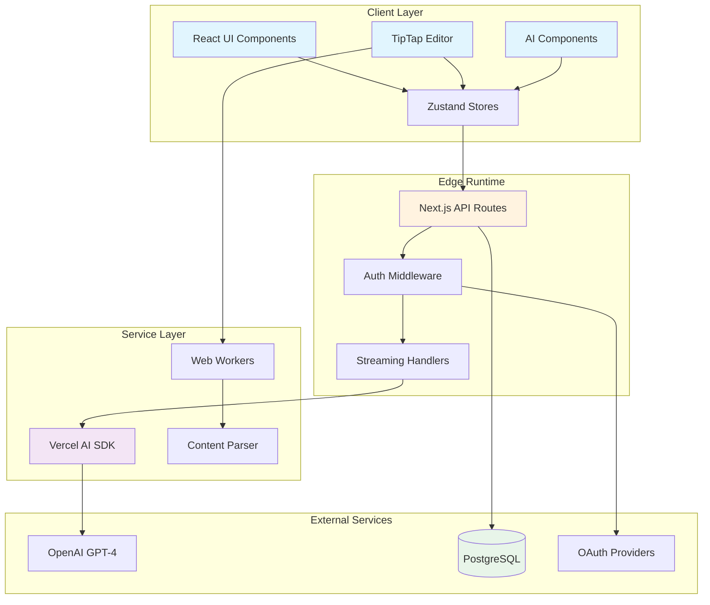
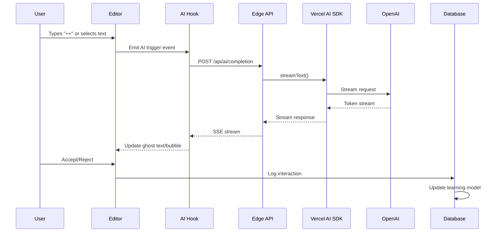
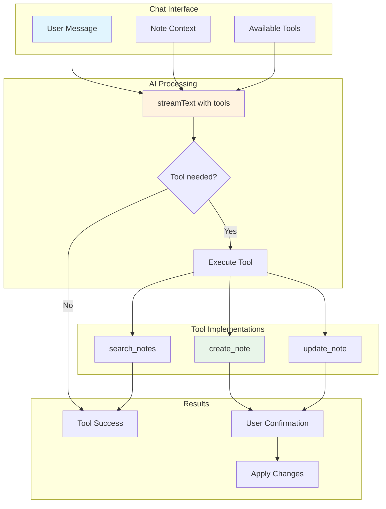
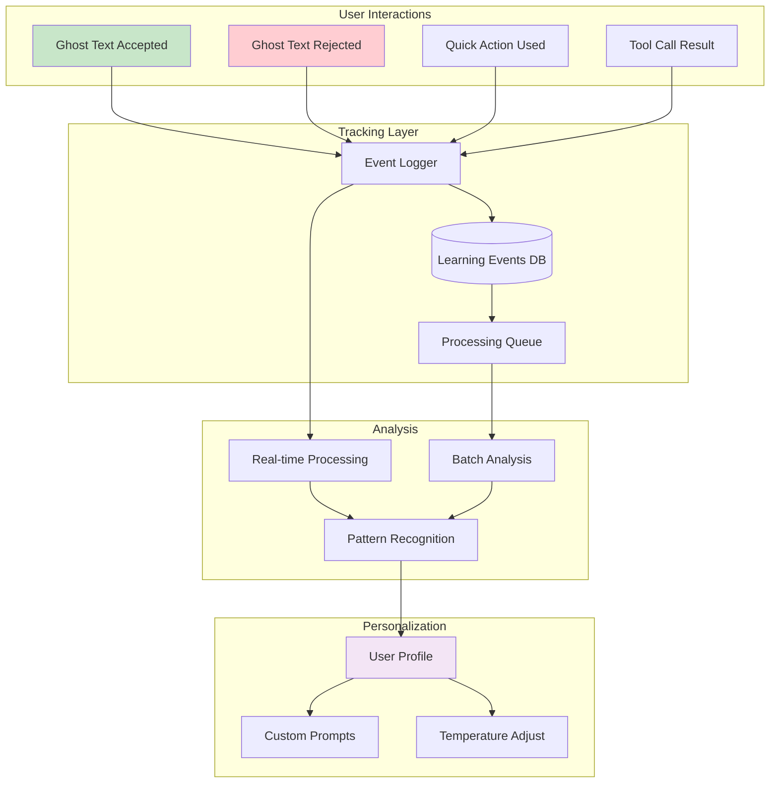
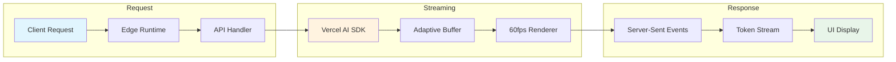
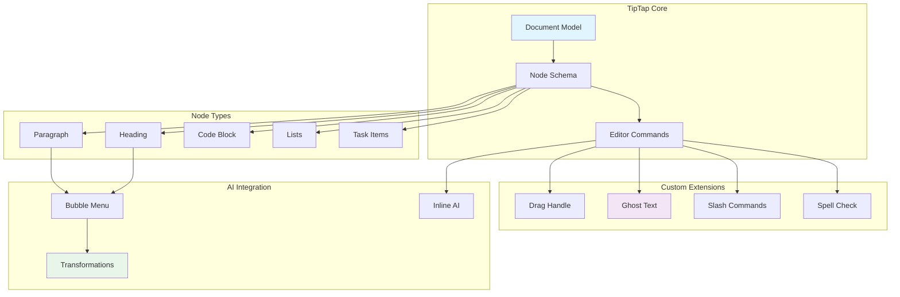
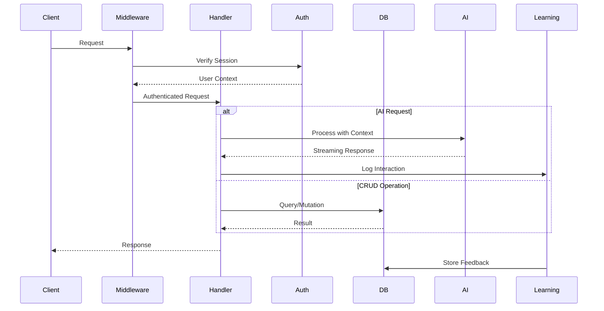
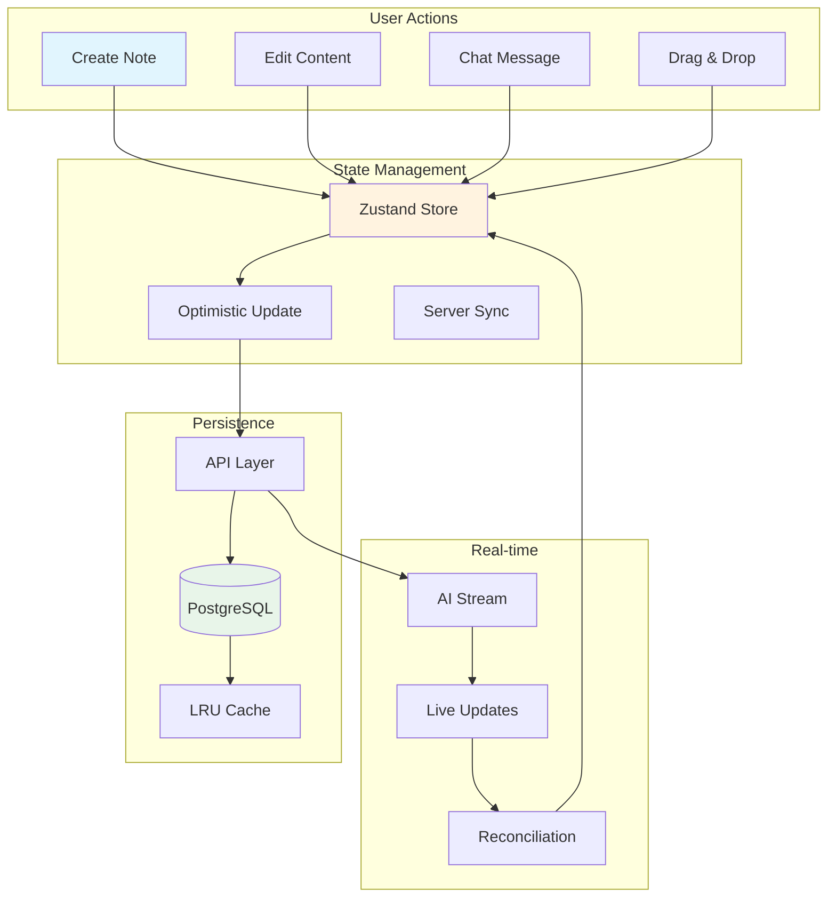

# Technical Documentation Diagrams

## 1. System Architecture Overview

## 2. AI Implementation Flow

## 3. Ghost Text Implementation

```mermaid
graph LR
    subgraph "TipTap Extension"
        Input[Text Input Handler]
        Trigger[++ Detection]
        Plugin[ProseMirror Plugin]
    end
    
    subgraph "React Hook"
        Hook[useGhostText]
        Completion[useCompletion]
        State[Position State]
    end
    
    subgraph "Rendering"
        Decoration[Widget Decoration]
        DOM[DOM Element]
        Style[Ghost Styling]
    end
    
    Input --> Trigger
    Trigger --> Plugin
    Plugin --> Hook
    Hook --> Completion
    Completion --> State
    State --> Decoration
    Decoration --> DOM
    DOM --> Style
    
    style Input fill:#ffebee
    style Hook fill:#e3f2fd
    style Decoration fill:#f3e5f5
```

## 4. Tool Calling Architecture

## 5. Grammar Checking Pipeline

```mermaid
graph LR
    subgraph "Main Thread"
        Editor[Editor Content]
        Extension[SpellCheck Extension]
        Debounce[Debounced Trigger]
    end
    
    subgraph "Web Worker"
        Worker[spell-check.worker.ts]
        Retext[Retext Processor]
        Plugins[Grammar Plugins]
    end
    
    subgraph "Results"
        Errors[Error List]
        Decorations[ProseMirror Decorations]
        UI[Underline UI]
    end
    
    Editor --> Extension
    Extension --> Debounce
    Debounce --> Worker
    Worker --> Retext
    Retext --> Plugins
    Plugins --> Errors
    Errors --> Decorations
    Decorations --> UI
    
    style Editor fill:#e1f5fe
    style Worker fill:#fff3e0
    style UI fill:#e8f5e9
```

## 6. Learning System Flow

## 7. Streaming Architecture

## 8. Block Editor Architecture

## 9. API Request Flow

## 10. Data Flow Architecture

## Implementation Notes

### Color Legend
- 🟦 Blue (#e1f5fe): Client/UI Components
- 🟨 Orange (#fff3e0): Processing/Middleware
- 🟪 Purple (#f3e5f5): AI/ML Components
- 🟩 Green (#e8f5e9): Data/Storage
- 🟥 Red (#ffcdd2): Errors/Rejections

### Key Patterns
1. **Streaming-First**: All AI interactions use SSE for real-time feedback
2. **Edge Runtime**: API routes run at edge for minimal latency
3. **Optimistic Updates**: UI updates immediately, syncs in background
4. **Web Workers**: Heavy processing offloaded from main thread
5. **Learning Loop**: Every interaction feeds back into personalization

These diagrams illustrate the sophisticated architecture that powers NoteChat's AI-first approach to note-taking and knowledge management.